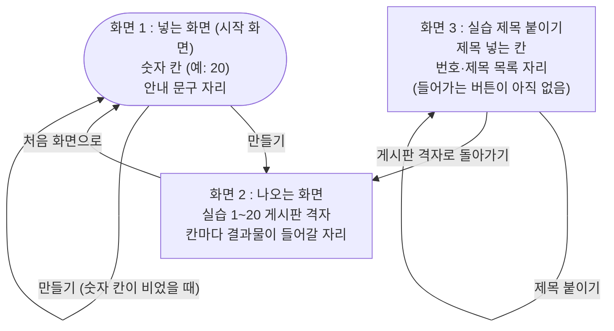

# 화면 흐름도

```mermaid
flowchart TD
    S1(["화면 1 : 넣는 화면 (시작 화면)<br/>숫자 칸 (예: 20)<br/>안내 문구 자리"])
    S2["화면 2 : 나오는 화면<br/>실습 1~20 게시판 격자<br/>칸마다 결과물이 들어갈 자리"]
    S3["화면 3 : 실습 제목 붙이기<br/>제목 넣는 칸<br/>번호·제목 목록 자리<br/>(들어가는 버튼이 아직 없음)"]

    S1 -->|"만들기"| S2
    S1 -->|"만들기 (숫자 칸이 비었을 때)"| S1
    S2 -->|"처음 화면으로"| S1
    S3 -->|"제목 붙이기"| S3
    S3 -->|"게시판 격자로 돌아가기"| S2
```

- 시작 화면 : 화면 1 하나 (둥근 상자로 표시)
- 돌아가는 버튼 : 화면 2의 [처음 화면으로], 화면 3의 [게시판 격자로 돌아가기] 둘 다 화살표로 들어 있다
- 남은 문제 : wireframe.png에 화면 3으로 가는 버튼이 없어서 화면 3으로 들어가는 화살표가 없다. 그림에 버튼을 넣기로 정하면 그때 화살표를 붙인다
